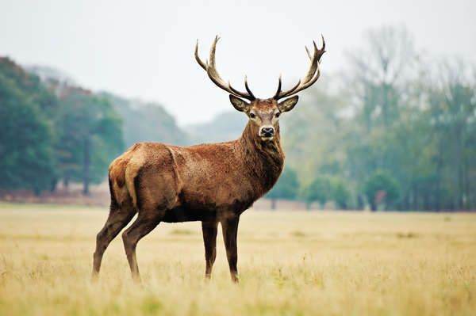
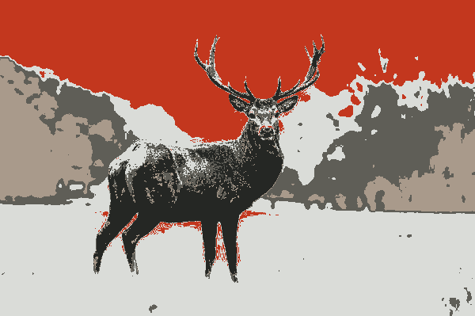

# img-cluster-filter

## pipeline

first, upload a theme image.


then upload a target image



the tool will auto extract theme colors from theme image


and then apply to target image



## Project setup
```
yarn install
```

### Compiles and hot-reloads for development
```
yarn serve
```

### Compiles and minifies for production
```
yarn build
```

### Lints and fixes files
```
yarn lint
```

### Customize configuration
See [Configuration Reference](https://cli.vuejs.org/config/).
